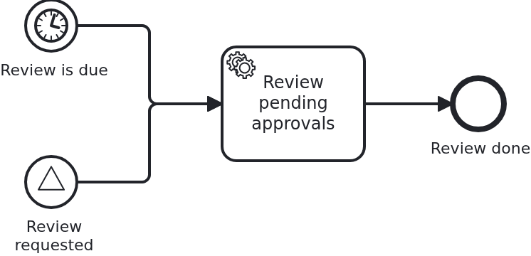

# Workflows the BPMS starts

[](./LICENSE)

Every other workflow begins with a call: the application has a business case, hands
VanillaBP its aggregate and a workflow starts. Here nobody calls. A timer fires, or a
broadcast signal arrives, and the engine begins a process for which no data exists yet.

## What this blueprint shows



A second process next to the loan approval of the base blueprint: a review that looks at the
loan approvals piled up so far. It has two start events, and neither of them can be
triggered by a call.

- **There is no `startWorkflow`.** Look at `nightlyreview/Workflow.java`: the class that
  owns `ProcessService` for this workflow has no method starting one, because there is
  nothing to start. That absence is the blueprint.
- **The aggregate comes into being on the way in.** A workflow needs one - tasks are routed
  by its ID and expressions read its attributes - so VanillaBP builds it: it instantiates
  the class, assigns the ID and saves it before anything else of the process runs. The class
  therefore needs a constructor without arguments, and every attribute may be null at that
  moment.
- **The ID is the engine's, not yours.** VanillaBP takes the most stable identity available:
  what the BPMS identifies the start by (a remote engine's process instance key), otherwise
  a timer's trigger time, otherwise a generated value. That order is what makes a repeated
  notification find the aggregate instead of building a second one.

`@WorkflowStartedByBpms` is optional, and this blueprint would run without it. It is here to
show the hook: the aggregate VanillaBP built is handed in together with a `BpmsStartTrigger`
saying what fired, and what the method writes is saved in the same transaction. Throwing
means the workflow does not start.

The signal start event is the one place where the application has a say. It can broadcast
`ReviewRequested` and thereby ask for a review, but it still does not start one: a broadcast
is a name, and what listens for it is the engine's business. That is also what makes this
blueprint compose with
[`bpmn-signals`](https://github.com/vanillabp-blueprints/bpmn-signals-springboot), which
shows the other half - a signal caught by workflows that already run.

Message start events are **not** part of this. Those are triggered by the application
through `startWorkflowByMessage`, which carries your aggregate, and they are shown in
[`bpmn-message-start`](https://github.com/vanillabp-blueprints/bpmn-message-start-springboot).

## Delta to the base blueprint

Compared to [`module-single`](https://github.com/vanillabp-blueprints/module-single-springboot):

|                   File                   |                                 What is different                                 |
|------------------------------------------|-----------------------------------------------------------------------------------|
| `nightly_review.bpmn`                    | a second process with a timer start event and a signal start event                |
| `nightlyreview/WorkflowTaskHandler.java` | `@WorkflowStartedByBpms` next to the ordinary `@WorkflowTask`                     |
| `nightlyreview/Service.java`             | what the trigger carries, written onto the aggregate VanillaBP built              |
| `nightlyreview/Workflow.java`            | `sendSignal` and, deliberately, no `startWorkflow`                                |
| `nightlyreview/model/Aggregate.java`     | an aggregate nobody constructs: ID assigned by VanillaBP, attributes filled later |
| `NightlyReviewIT.java`                   | a test that cannot start anything and waits for an aggregate to appear            |

## Running it

Requires a JDK 21. Camunda 7 is embedded, so nothing else has to run:

```bash
mvn install verify
```

Running it on another BPMS is a Maven profile, not one line of Java changes:

```bash
mvn install verify -Pcamunda8
```

Camunda 8 is a remote engine, so a cluster has to run. Start one; its address, and everything
else specific to that engine, lives in its profile file
`application/src/main/resources/application-camunda8.yaml`, with a copy for the module's own
test:

```yaml
vanillabp:
  adapters:
    camunda8:
      # Camunda 8 is a remote engine: point this at your cluster.
      rest-address: http://localhost:8080
```

That file is loaded because the Maven profile `camunda8` sets the Spring profile of the same
name, so the engine is chosen once, on the Maven command line, and the build, the tests and
`spring-boot:run` all follow it.

The Process-Engine-API adapter cannot run this blueprint, and says so rather than starting
badly: that API never reports a start the application did not ask for, so deploying such a
process fails with a message naming the element.

Start the application:

```bash
mvn -pl application spring-boot:run
```

Nothing about identifiers shows up at startup: the BPMS profiles of this blueprint set
`name-clash-avoidance: use-prefix`, so VanillaBP puts the workflow module ID in front of every
identifier before it reaches the engine and takes it off again on the way back. The BPMN files,
the business code and the rest of the configuration keep the plain names, and no tenant is
involved, which matters on a BPMS licensed per tenant. What the modes are and what each of them
costs is in
[the wiki](https://github.com/vanillabp/adapter-platform-integration/wiki/Workflow-modules#how-name-clashes-are-avoided).

Then do nothing. Five seconds after the model was deployed the timer fires, and a workflow
exists that nobody asked for:

```
A nightly review 'a41f…' was started by the BPMS: TIMER at 2026-08-14T09:12:31Z, from start event 'StartEvent_ScheduledReview'. Nobody called startWorkflow
The nightly review 'a41f…' looked at 0 loan approval(s)
```

The reviews are listed at

```
http://localhost:8080/api/nightly-review
```

Asking for one instead of waiting broadcasts the signal:

```
http://localhost:8080/api/nightly-review/request
```

```
A review was requested. Whether one starts is the engine's decision
A nightly review '7c02…' was started by the BPMS: SIGNAL at 2026-08-14T09:13:02Z, from start event 'StartEvent_ReviewRequested'. Nobody called startWorkflow
```

The loan approval of the base blueprint is still there, started the ordinary way, and gives
the review something to count:

```
http://localhost:8080/api/loan-approval/start?amount=5000
```

While the application runs on Camunda 7, Camunda's own web applications are served at

```
http://localhost:8080/camunda
```

Log in with `demo` / `demo`. Cockpit shows the review instances with no business key of
their own choosing - the ID VanillaBP assigned is what identifies them. The user comes from
`application/src/main/resources/application-camunda7.yaml` and exists so that the
blueprint can be operated without setting one up; an application with an identity provider
of its own leaves that section out.

The Camunda 8 profile brings neither the dependency nor those settings into effect. Its
tooling is part of the cluster, and the file naming a Camunda 7 adapter id is simply not
loaded there - a profile file applies to its own engine and to no other. Naming an adapter
id whose adapter is not on the classpath is a configuration error VanillaBP refuses to
start with, and the profiles are what keeps that from happening.

## How it works

|                            File                            |                                   Role                                   |
|------------------------------------------------------------|--------------------------------------------------------------------------|
| `.../loan-approval/processes/camunda7/nightly_review.bpmn` | the process: a timer start event, a signal start event, one service task |
| `.../nightlyreview/WorkflowTaskHandler.java`               | `@WorkflowStartedByBpms`, the hook into a start nobody triggered         |
| `.../nightlyreview/Service.java`                           | writes what the trigger carried; contains no way to start a review       |
| `.../nightlyreview/Workflow.java`                          | `sendSignal` for asking, and no `startWorkflow` at all                   |
| `.../nightlyreview/model/Aggregate.java`                   | the aggregate VanillaBP instantiates, with the ID it assigned            |
| `loan-approval/src/test/.../NightlyReviewIT.java`          | waits for a workflow to appear, because it cannot start one              |

The order of events: the model is deployed while the application boots, the engine
schedules the timer, and five seconds later it fires. VanillaBP is notified, opens a
transaction, instantiates the aggregate, assigns its ID, copies process variables of the
model into equally named attributes, runs the `@WorkflowStartedByBpms` method and saves.
Only then does the process continue to its service task, which is an ordinary
`@WorkflowTask` - from there nothing about this workflow is special.

How the two engines arrange that differs, and it is worth knowing which part is theirs.
Camunda 7 runs an execution listener on the start event inside its own transaction, so the
aggregate and the process instance commit together, and the aggregate's ID becomes the
instance's business key. Camunda 8 has VanillaBP add an execution listener whose job builds
the aggregate and writes its ID into the instance; the listener gates the workflow, so
nothing runs before the aggregate exists.

The test is the unusual part. It has no call to make, so it waits for an aggregate with the
expected trigger kind to appear. For the signal it broadcasts in a poll loop rather than
once: a signal is not buffered, and a subscription that is a moment late gets nothing.

## Documentation

- [Starting workflows](https://github.com/vanillabp/adapter-platform-integration/wiki/Starting-workflows): the whole picture, including which ID the aggregate gets and what each BPMS supports
- [Workflow aggregates](https://github.com/vanillabp/adapter-platform-integration/wiki/Workflow-aggregates): why the aggregate has to exist before the process runs
- [Workflow tasks](https://github.com/vanillabp/adapter-platform-integration/wiki/Workflow-tasks): the ordinary half of the wiring, unchanged here
- the wiki of the [BPMS adapter](https://github.com/vanillabp/adapter-platform-integration/wiki/BPMS-adapters) you use: what its engine does with a start event nobody triggered

This blueprint is developed in the monorepo
[`blueprints`](https://github.com/vanillabp-blueprints/blueprints). This repository is a
read-only mirror, **issues and pull requests belong there.**

## Noteworthy & Contributors

[VanillaBP](https://www.github.com/vanillabp/spi-for-java) was developed by [Phactum](https://www.phactum.at) with the
intention of giving back to the community as it has benefited the community in the past.


## License

Copyright 2026 Phactum Softwareentwicklung GmbH

Licensed under the Apache License, Version 2.0
